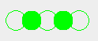
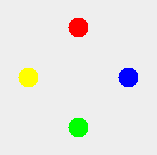

# Animated Figures

## Running

### Prerequisites

- JDK 15 installed and `JAVA_HOME` set

### Starting

- run `.\gradlew :run`

## Implementation

The implementation of *Animated Figures* provides a way to animate shapes. It is split into four parts, [UI](#ui)
, [Shapes](#shapes), [Figures](#figures)
and [Visitors](#visitors).

### UI

The UI part of the implementation consists solely of a `MainPane`. This pane stores and displays all the shapes. It also provides
a `startAnimation` method, which starts the animation loop in its own thread. To simplify the application a
class `AnimatedShape` was added. This class stores a `Shape` and a list of visitors. With an `animate` method the shape is animated by calling
the `accept` method of the shape with every visitor of the list. With a `draw` method the shape can be drawn by calling the `accept` method of
the shape with a `DrawVisitor` (see [Draw Visitor](#draw-visitor)).

### Shapes

To abstract over the shapes of the implementation an interface `Shape` as well as two subinterfaces `ShapeGroup` and `SimpleShape`
were implemented. A `ShapeGroup` can contain multiple Shapes and `SimpleShape` models a
concrete shape like a circle or a rectangle (coincidentally both of those shapes were implemented as an implementation of `SimpleShape`). Both `ShapeGroup` and `SimpleShape` have an abstract base class `ShapeGroupBase` and `SimpleShapeBase`
which implements method which should be the same for all implementations (e.g. getter/setter for the position).

The three interfaces provide the following operations. Interesting is, that the drawing of the shapes is not implemented
in the shape itself but rather with a visitor (see [Visitors](#visitors)).

#### Shape

- get size
- get position
- move by x amount
- resize by x amount
- accepting a `ShapeVisitor` (see [Visitors](#visitors))

#### ShapeGroup

- getting all the containing shapes

#### SimpleShape

- setting/getting the color
- moving to a position
- setting the position
- setting/getting if a shape is filled

### Figures

For this implementation two figures strikingly named [FigureA](#figure-a) and [FigureB](#figure-b) were implemented.
Both implement the `ShapeGroup` interface.

#### Figure A

`FigureA` consists of 5 green circles side by side and every other circle is filled.

#### Figure B

`FigureB` consists of 4 circle in the colors red, blue, green and yellow aligned in a diamond.

### Decorators

The implementation provides two decorators `BackgroundDecorator` and `BorderDecorator`. They both extend a
superclass `ShapeDecorator` which implements the decorator pattern for the `Shape`. This means not only a `ShapeGroup`
can be decorated but also a `SimpleShape`. This was not used in the implementation of `FigureA` or `FigureB`. It could have been
though...but it wasn't.

#### Background Decorator

The `FigureA` decorated with a `BackgroundDecorator` looks like this.

#### Border Decorator

The `FigureB` decorated with a `BorderDecorator` looks like this.

### Visitors

The visitor pattern was used in this implementation to provide the possibility to implement different operations on all
available shapes. For this an interface `ShapeVisitor` was implemented which provides a `visit` method, which
accepts `FigureA`, `FigureB`, `Circle` and `Rectangle`. This allows to customize the implementation for each figure.

The implementation provides the following five concrete implementations for this interface.

#### Draw Visitor

This visitor is especially interesting, since it separates the drawing logic from the shapes. This makes it possible to
adapt it to an even more outdated UI framework like AWT.

In this implementation `Circle` and `Rectangle` are drawn with their respective `awt.Graphics` methods `drawOval`
and `drawRect` and `ThingA` and `ThingB` are drawn by passing the visitor to the `accept` method of each sub shape.

This is done for most visitors where there is no special implementation for `ThingA` and `ThingB`.

#### Fill Toggle Visitor

As the name suggests, it toggles the `isFilled` property of a `SimpleShape`. For `ShapeGroups` the visitor forwards
itself to the children of the group.

#### Move Visitor

The `MoveVisitor` moves a shape on the axis. The outer bounds as well as the amount moved can be configured. Since every
shape has a `move` method it calls this method regardless of the concrete shape type.

#### Resize Visitor

This visitor resizes a shape. It can be configured with a series of steps or with a range and step size. Same with
the [Move Visitor](#move-visitor), the `resize` method of the shape is called.

#### Rotate Visitor

This visitor was implemented to illustrate the usefulness of providing a different method for `ThingA` and `ThingB` (
since until now a single `visit` method for a `ShapeGroup` would have sufficed). This visitor as the name suggests
rotates a shape.

For `FigureA` the first circle stays static, and the remaining circles are moved by 90 degrees (if the 2nd circle is
right of the first one it is moved under the first circle).

For `FigureB` the implementation is even simpler. Since it is known that the figure consists of four circles, each
circle moves to the position of the next circle.

For `Circle` a highly sophisticated algorithm is used to calculate its correct rotation.

For `Rectangle` width and height are swapped.